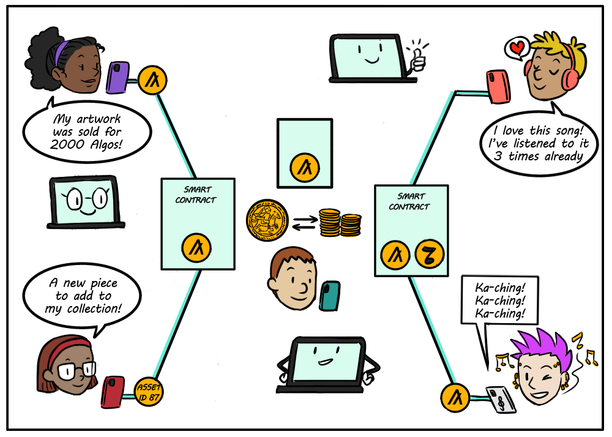

title: What is a dApp?

Decentralized Applications, or dApps, are applications that are run in a decentralized computing system, like a blockchain. This guide will introduce what dApps are and how dApps are architected and implemented on the Algorand blockchain.

{: style="width:500px" align=center }
<figcaption style="font-size:12px">A segment of the dApp ecosystem.</figcaption>

In the previous section, we discovered some of the properties of blockchain and how they offer paths to innovate on use cases that exchange items of value. A payment application, where users can exchange assets with each other, is a very simple dApp. In this use case, the payment transaction primitive is the only on-chain logic required to transfer those assets. 

But how do we implement a more complex scenario, like bidding in an auction? We could build a website, have users log in, send us their bids, then issue the on-chain transfer of the item to the highest bidder. We’d then have to send the highest bid amount to the seller and return the rest of the funds to all the losing bidders. The problem with this is that your users will have to trust that you won’t run off with their bids, that the code you wrote to hold funds is sound (probably without getting to see it), that you implement world-class security practices so that you won’t get hacked, etc. 

This implementation completely misses the mark on what blockchain promises and we are no better off using the blockchain than just using some of the centralized auction sites that exist already. If you’re a reputable company, then people probably trust you, but if you’re [someone like Alice](../basics/what_is_blockchain/#alice-and-bobs-auction){: target="_blank"}, who is trying to build their reputation from scratch, then you’ll have a hard time getting users. And in the former scenario, you are still very much at-risk to attackers who may know that you have a large concentration of funds. The moral of this story is that we need a way to implement this bidding logic, securely, on-chain. 

This is where smart contracts come into play.

# Smart contracts

Smart contracts are on-chain logic programs that can implement highly customized transfer conditions. They can be composed with all other layer-1 features, (including Algos, NFTs, fungible tokens) to produce powerful and sophisticated decentralized applications. 

Let’s return to the auction bidding scenario and use smart contracts to implement on-chain bidding. What this means is that instead of sending bids to an account controlled by a centralized entity, subject to attacks and single points of failure, we can send those bids to a smart contract, governed by code, that is open and publicly verifiable by anyone. And that code won’t unexpectedly change. That doesn’t mean it can’t change, but if it does, it will be public and evident to users. And if you don’t like the idea that it can change, you can even program it from the start to restrict certain changes or disallow all changes to the contract. 

In summary, you go from trusting an entity and _hoping_ that they will do what they promised, to trusting the code and _knowing_ it will do what it promised, regardless of the different actors involved and the different motivations they might have. 

An important sidebar here is that it is critical for smart contract code to be reviewed and audited for security flaws. Badly written code that does not account for all potential attack vectors of course will not secure anything. 

# What language can I use to write smart contracts?
On Algorand, you can write smart contracts in Python with the PyTeal library. You can also use a JavaScript-like language called Reach. The next section will explain how to build your dApp with Python. You can find more details on how to build dApps with Reach [here](https://docs.reach.sh/){: target="_blank"}.

Before proceeding, let's revisit Alice and Bob's auction and make sure we've settled on the important on-chain components.

# Alice and Bob’s auction design
Alice and Bob think through the features for their dApp. They list off the following requirements:

1. Sellers must be able to create a new auction for each piece of artwork. The artwork must be held by the contract after the auction begins and until the auction closes.
2. The auction can be closed before it begins, in which case the artwork will be returned to the seller.
3. Sellers can specify a reserve price, which if not met, will return the artwork to them.
4. For each bid, if the new bid is higher than the previous bid, the previous bid will be refunded to the previous bidder and the new bid will be recorded and held by the contract.
5. At the end of a successful auction, where the reserve price was met, the highest bidder will receive the artwork and the seller will receive the full bid amount.

Now onto the next sections where you will learn how to build the auction dApp using [Python and the PyTeal library](https://developer.algorand.org/docs/get-started/dapps/pyteal/) or using [Reach](https://developer.algorand.org/docs/get-started/dapps/reach/). 
