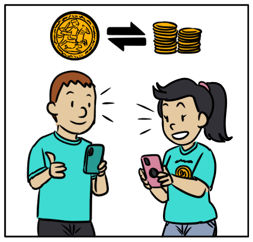

title: Algos and assets
This section is intended for developers who are looking to add support for Algos or Algorand Standard Assets (ASAs) to their applications. For example, if you are a wallet or an exchange developer, this guide is for you. It will give you an overview of the features that we believe are most relevant for your use case and provide links on where to go for more in-depth explanations.

<center>
{: style="width:300px"}
<figcaption style="font-size:12px">Users exchange assets using their mobile wallets.</figcaption>
</center>

# Algo payments and ASA transfers
To get you started quickly, we recommend checking out the SDK getting started pages where you will find code that demonstrates how to create accounts, send Algo payment transactions, and close out accounts in each of the four SDKs.

=== "Python"
    [Your first Algo payment transaction](../../../sdks/python){: target="_blank"}

=== "JavaScript"
    [Your first Algo payment transaction](../../../sdks/javascript){: target="_blank"}

=== "Java"
    [Your first Algo payment transaction](../../../sdks/java){: target="_blank"}

=== "Go"
    [Your first Algo payment transaction](../../../sdks/go){: target="_blank"}
 

And for ASAs, the following code will show you how to opt-in, transfer, and close out ASA balances.

=== "Python"
    [Run code](https://replit.com/@Algorand/ASAIntegrationPython#main.py){: target="_blank"}

=== "JavaScript"
    [Run code](https://replit.com/@Algorand/ASAIntegrationsJS#main.js){: target="_blank"}

=== "Java"
    [Run code](https://replit.com/@Algorand/ASAIntegrationsJava#Main.go){: target="_blank"}

=== "Go"
    [Run code](https://replit.com/@Algorand/ASAIntegrationGo#main.go){: target="_blank"}

Continue on for further explanations of these features and links to more details.

# Transactions and minimum balances

Transferring ASAs is very similar to transferring Algos. `pay` transactions exclusively transfer **Algos**, while `axfer` transaction exclusively transfer **ASAs**. The key structural differences between Algo payments and ASA transfers are summarized in the table below.

|Field Description|Payment (Algos)|Transfer (ASAs)|
|-----|----|------|
|Transaction `"type"`|`"pay"`|`"axfer"`|
|Total amount to transfer|`"amt"`|`"aamt"`|
|Sender|`"snd"`|`"snd"`|
|Receiver|`"rcv"`|`"arcv"`|
|Asset Identifier|No need to specify an ID since Algos is implied by the transaction type.|The value of `"xaid"` determines the specific asset to be transferred.|
  
Accounts on Algorand require a minimum balance of 100,000 microAlgos. This balance requirement increases by 100,000 microAlgos for each asset holding.
  
**More details on transactions and min. balances**

* [Parameters Table](../../../get-details/parameter_tables/){: target="_blank"}- A comprehensive list of fees and minimum balance requirements.
* [Transaction fields](../../../get-details/transactions/){: target="_blank"}- The full list of required and optional transaction fields.
* [Payment (Algos) transaction](../../../get-details/transactions/#payment-transaction){: target="_blank"}
* [Transfer (ASAs) transaction](../../../get-details/transactions/#asset-transfer-transaction){: target="_blank"}
* [ASA transfer structure](../../../get-details/transactions/#transfer-an-asset){: target="_blank"}
* [ASA opt-in structure](../../../get-details/transactions/#opt-in-to-an-asset){: target="_blank"}
* [How to transfer ASAs](../../../get-details/asa/#transferring-an-asset){: target="_blank"}
* [How to opt-in to ASAs](../../../get-details/asa/#receiving-an-asset){: target="_blank"}


----------

# Opting in and out of ASAs

Any account can receive Algos, but a potential recipient of a specific ASA must first opt-in to the asset so that the account holder does not see their minimum balance requirement increase without their knowing.   
  
"Opting In" to an asset is simply an asset transfer of 0, to and from the opting in account as shown in the table below.

|Field Description|Transfer (ASAs)| Opt-In (ASAs)|
|-----|------|-----|
|Transaction `"type"`|`"axfer"`|`"axfer"`|
|Total amount to transfer|`"aamt"`|`"aamt"` with value of `0`|
|Sender|`"snd"`|`"snd"` (must be same as `"arcv"`)|
|Receiver|`"arcv"`|`"arcv"` (must be same as `"snd"`)|
|Asset Identifier|The value of `"xaid"` determines the specific asset to be transferred.|The value of `"xaid"` determines the specific asset to opt-in to.|

"Opting out" of an asset requires specifying an `AssetCloseTo` (`"aclose"`) field in the [Asset Transfer transaction type](../../../get-details/transactions/#asset-transfer-transaction). This will result in removal of the ASA holding from the sender's account and a decrease in the minimum balance requirement for that account by 100,000 microAlgos.


# Closing accounts

[In the Algo `"pay"` transaction](../../../get-details/transactions/#close-an-account){: target="_blank"}, you can close-out an account by specifying an address in the optional `CloseRemainderTo` (`"close"`) field. The result of this action is that the remaining account balance will be sent to the specified address and the `"snd"` address will be effectively removed from the ledger.

An account must opt-out of all asset holdings _before_ closing out its Algo balance.


# Where to find account balances

Algo and ASA balances are both located in an [account's balance record](https://developer.algorand.org/docs/reference/rest-apis/algod/v2/#account){: target="_blank"}.

[`GET /v2/accounts/{address}`](../../../rest-apis/algod/v2/#get-v2accountsaddress){: target="_blank"}

The Algo balance can be found at the top level under `"amount"`, while multiple ASA balances are contained in an array under `"assets"`.

|Algo Balance | ASA Balance |
|---|---|
|`"amount": <micro-algo-balance>`|`"assets":[{"amount": <asa-balance>, "asset-id": <asset-id>, ...}, ...]`|

# Accounting for balance updates
If you are doing your own accounting of transactions and updates to balances, be aware that there are a couple of ways that balances can be updated outside of so-called “normal" transactions.

## Inner transactions
Transactions can be sent from smart contracts and these are called [inner transactions](../../../get-details/dapps/avm/teal/specification/#inner-transactions){: target="_blank"}. These transactions can be found in the [`inner-txns`](../../../rest-apis/algod/v2/#pendingtransactionresponse){: target="_blank"} field of the application call transaction that triggered them. See sample output from `algod` and `indexer` APIs. 

=== "algod"
    ```json
    {
        "dt": {
        .
        .
        .
        "inner-txns": [
            {
            "pool-error": "",
            "txn": {
                "txn": {
                "amt": 20000,
                "fee": 1000,
                "fv": 11,
                "lv": 1011,
                "rcv": "GDA5MWDRLWIQ7G2YZABYYLAA2ZCCZYRZTXR35CTCECL52FNUMXYCC2JXYU",
                "snd": "LMTOYRT2WPSUY6JTCW2URER6YN3GETJ5FHTQBA55EVK66JG2QOB32WPIHY",
                "type": "pay"
                }
            }
            }
        ]
        .
        .
        .
                },
        .
        .
        .
            "txn": {
                    .
        .
        .
                "type": "appl"
                }
            },
        {

        .
        .
        .

        "inner-txns": [
            {
            "pool-error": "",
            "txn": {
                "txn": {
                "amt": 20000,
                "fee": 1000,
                "fv": 11,
                "lv": 1011,
                "rcv": "GDA5MWDRLWIQ7G2YZABYYLAA2ZCCZYRZTXR35CTCECL52FNUMXYCC2JXYU",
                "snd": "LMTOYRT2WPSUY6JTCW2URER6YN3GETJ5FHTQBA55EVK66JG2QOB32WPIHY",
                "type": "pay"
                }
            }
            }
        ]
        .
        .
        .
    }
    ```

=== "indexer"
	```json
        {
        "application-transaction":{
            .
            .
            .
            "confirmed-round":1,
            "fee":0,
            "first-valid":0,
            "id":"LWAEU3YRMRPYUF2ARMUOYUYZVQLNECBII3OVDUDPBUQDGGTFL5NA",
            "inner-txns":[
                {
                    "asset-transfer-transaction":{
                        "amount":222,
                        "Asset-id":11,
                        "Close-amount":0,
            "receiver":"PIJRXIH5EJF7HT43AZQOQBPEZUTTCJCZ3E5U3QHLE33YP2ZHGXP7O7WN3U",
                    "sender":"PT4K5LK4KYIQYYRAYPAZIEF47NVEQRDX3CPYWJVH25LKO2METIRBKRHRAE"
                    },
                    "close-rewards":0,
                    "closing-amount":0,
                    "confirmed-round":1,
                    "fee":654,
                    "first-valid":3,
                    "id":"UCNMXYBCHZ5TAORO6BKU5SAPXKPP4WHQEE7SNKS3XBUO63XYZEKQ",
                    "intra-round-offset":2,
                    "last-valid":0,
                    "receiver-rewards":0,
                    "round-time":1631812141,
                    "sender":"PT4K5LK4KYIQYYRAYPAZIEF47NVEQRDX3CPYWJVH25LKO2METIRBKRHRAE",
                    "sender-rewards":0,
                    "signature":{
                        
                    },
                    "tx-type":"axfer"
                }
            ],
            .
            .
            .
        },
        "tx-type":"appl"
    }
	```

## Rewards
Network rewards are also distributed differently from standard transactions and are available through the `algod` and `indexer` APIs. Read this technical overview of rewards for more details.

> [Rewards technical overview](https://www.algorand.com/resources/blog/rewards-technical-overview){: target="_blank"}

# Rekeying
Algorand provides a feature that allows any account to be rekeyed by signing a transaction for that account over to the new governing key. We call this out here in case understanding the association between public addresses and authorizing keys or logic is important to your use case. Also be aware that accounts can even be rekeyed to a smart contract, which means that the smart contract code will govern it too.

> [Rekeying](../../../get-details/accounts/rekey/){: target="_blank"}

